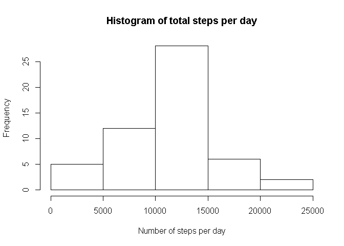
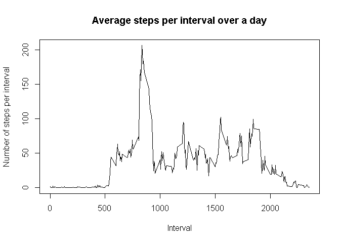
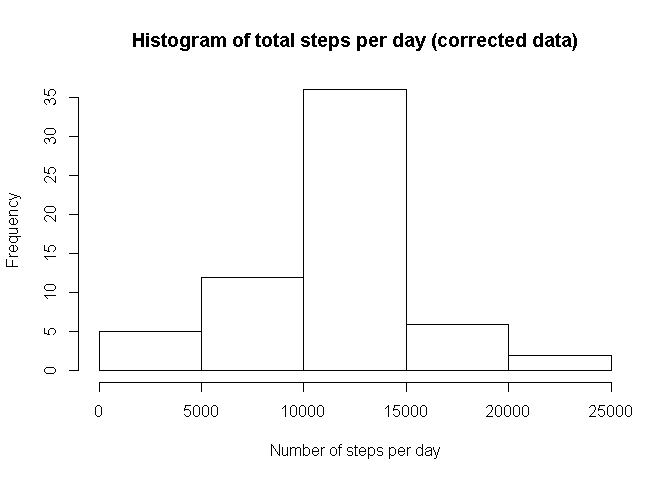
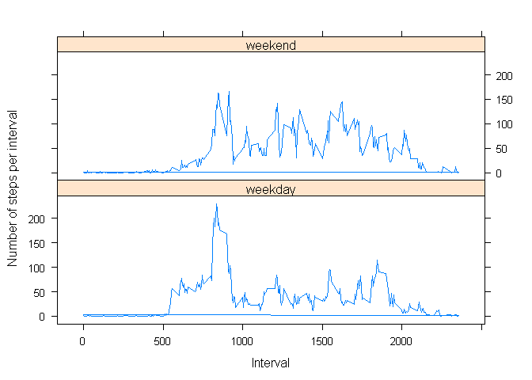

# Reproducible Research: Peer Assessment 1
  The objective of this report is to describe the extraction, processing and analysis of the activity data captured from a personal measurement device. The process is described in five steps, as follows:  

1. Loading and preprocessing the data
2. Analysing the total number of steps taken per day
3. Anaylsing the average daily activity
4. Imputing any missing values
5. Analysing differences in daily activity patterns between weekdays and weekends  

The report will include the code and results of the analysis.  

## Loading and preprocessing the data

First, we will load the data from the "activity.csv" file contained in the repository, and load the data into a data table.  


```r
setwd("~/R/working/RepData_PeerAssessment1")
library(lubridate)
```

```
## 
## Attaching package: 'lubridate'
```

```
## The following object is masked from 'package:base':
## 
##     date
```

```r
library(dplyr)
```

```
## 
## Attaching package: 'dplyr'
```

```
## The following objects are masked from 'package:lubridate':
## 
##     intersect, setdiff, union
```

```
## The following objects are masked from 'package:stats':
## 
##     filter, lag
```

```
## The following objects are masked from 'package:base':
## 
##     intersect, setdiff, setequal, union
```

```r
library(lattice)
inp_data <- read.csv(unz("activity.zip", "activity.csv"))
str(inp_data)
```

```
## 'data.frame':	17568 obs. of  3 variables:
##  $ steps   : int  NA NA NA NA NA NA NA NA NA NA ...
##  $ date    : Factor w/ 61 levels "2012-10-01","2012-10-02",..: 1 1 1 1 1 1 1 1 1 1 ...
##  $ interval: int  0 5 10 15 20 25 30 35 40 45 ...
```

Next, we convert the date variable into a readable format using lubridate, and extract the day of the week as a new variable.  


```r
inp_data$date <- ymd(as.character(inp_data$date))
inp_data$day <- wday(inp_data$date)
str(inp_data)
```

```
## 'data.frame':	17568 obs. of  4 variables:
##  $ steps   : int  NA NA NA NA NA NA NA NA NA NA ...
##  $ date    : Date, format: "2012-10-01" "2012-10-01" ...
##  $ interval: int  0 5 10 15 20 25 30 35 40 45 ...
##  $ day     : num  2 2 2 2 2 2 2 2 2 2 ...
```

## What is mean total number of steps taken per day?

To determine the mean number of steps taken per day, we first determine the total number of steps taken each day using tapply(, and visualise the result in a histogram.  


```r
daily_steps <- tapply(inp_data$steps, inp_data$date,sum)
head(daily_steps)
```

```
## 2012-10-01 2012-10-02 2012-10-03 2012-10-04 2012-10-05 2012-10-06 
##         NA        126      11352      12116      13294      15420
```

```r
hist(daily_steps, xlab = "Number of steps per day", ylab = "Frequency", main = "Histogram of total steps per day")
```

<!-- -->

Next we take the average of the total daily steps, being careful to exclude any NAs.  


```r
mean(daily_steps[!is.na(daily_steps)==TRUE])
```

```
## [1] 10766.19
```

```r
median(daily_steps[!is.na(daily_steps)==TRUE])
```

```
## [1] 10765
```

This shows us that the mean number of steps taken each day is 10766.19 and the median is 10765.  

## What is the average daily activity pattern?

We start by determining the average number of steps per interval, again using tapply, and excluding any NA values.  


```r
interval_steps <- tapply(inp_data$steps, inp_data$interval,mean, na.rm=TRUE)
head(interval_steps)
```

```
##         0         5        10        15        20        25 
## 1.7169811 0.3396226 0.1320755 0.1509434 0.0754717 2.0943396
```

Next, we generate a line chart to show the average trend over a day.  


```r
plot(rownames(interval_steps), interval_steps, type="l", xlab = "Interval", ylab="Number of steps per interval", main = "Average steps per interval over a day")
```

<!-- -->

This suggests that the peak average steps is between intervals 800 and 900. We determine the exact peak as follows:    


```r
interval_steps[interval_steps==max(interval_steps)]
```

```
##      835 
## 206.1698
```

This shows that the peak number of mean steps is 206.1698 and occurs in the interval labeled 835.  

## Imputing missing values

We want to avoid NAs from biasing the results of any analysis, so we look at replacing the NAs with a more suitable value.  

1. First, we determine the number of NAs in the dataset.  


```r
sum(is.na(inp_data$steps))
```

```
## [1] 2304
```

This shows that there are 2304 NA values in the dataset, out of 17568, so around 13%

2. Next, we devise a strategy for replacing the NAs. A basic approach is chosen, which is to replace an NA with the average for that particular interval.  

3. Next, we replace the NAs with the mean for that interval, using the strategy devised in the previous step. We apply this by first using dplyr to create a new variable, containing the mean of that interval's daily steps, then copying this into all the steps variables that are NA.  


```r
inp_data_new <- inp_data %>% group_by(interval) %>% mutate(interval.mean = mean(steps, na.rm=TRUE))
inp_data_new$steps[is.na(inp_data$steps)] <- inp_data_new$interval.mean[is.na(inp_data$steps)]
```

4. Now we can analyse the cleaned dataset, first by producing the same histogram created earlier, and determining the mean and mediam number of steps per day.  


```r
daily_steps_new <- tapply(inp_data_new$steps, inp_data_new$date,sum)
head(daily_steps_new)
```

```
## 2012-10-01 2012-10-02 2012-10-03 2012-10-04 2012-10-05 2012-10-06 
##   10766.19     126.00   11352.00   12116.00   13294.00   15420.00
```

```r
hist(daily_steps_new, xlab = "Number of steps per day", ylab = "Frequency", main = "Histogram of total steps per day (corrected data)")
```

<!-- -->

```r
mean(daily_steps_new)
```

```
## [1] 10766.19
```

```r
median(daily_steps_new)
```

```
## [1] 10766.19
```

From comparing these results to the results for the original dataset, we can see that the cleaning up has not changed the mean of the average daily steps, while the median has shifted slightly to equal the mean.  

## Are there differences in activity patterns between weekdays and weekends?

We want to compare the daily activity patterns for weekdays and weekends. To do this, we add a new variable, which denotes whether a day is a weekday or a weekend. This is then converted to a factor to facilitate plotting the results.  


```r
inp_data_new <- inp_data_new %>% mutate(week.day = "weekday")
inp_data_new$week.day[inp_data_new$day==1] <- "weekend"
inp_data_new$week.day[inp_data_new$day==7] <- "weekend"
inp_data_new$week.day <- as.factor(inp_data_new$week.day)
```

We can now plot daily activity patterns for the weekdays and the weekends as follows:  


```r
interval_steps_new <- inp_data_new %>% group_by(interval,week.day) %>% mutate(int.mean = mean(steps))
xyplot(interval_steps_new$int.mean~interval_steps_new$interval|interval_steps_new$week.day, type="l", layout=c(1,2), xlab = "Interval", ylab = "Number of steps per interval")
```

<!-- -->

The comparison suggests that there is a higher level of activity across the day on weekends, while on weekdays the activity tends to be concentrated at the beginning of the day.  

